## Adam Svestka (me)

> 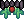
>
> 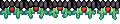
>
> 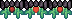
>
> 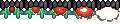

> 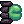
>
> 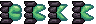
>
> 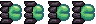
> 
> 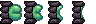

## [Admurin](https://admurin.itch.io/enemy-galore-1)

LICENSE

    You can use this asset in any game project, personal or commercial
    DO NOT resell or redistribute AS A GAME ASSET, it has to be part of a project
    Credit not necessary but appreciated, if you do you can link to my ITCH profile
    Modify to suit your needs
    You are NOT allowed to turn any of my assets to an NFT.

> 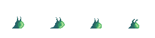
>
> 
>
> 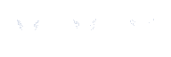
>
> 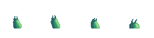
>
> 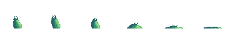

## [adwitr](https://adwitr.itch.io/pixel-health-bar-asset-pack-2)

> 
>
> 

## [blackdragon1727](https://blackdragon1727.itch.io/pixel-mini-effect)

LICENSE

    - Free to use on non-commercial games, please leave comments and reviews that help motivate me.
    - If you will be using on a commercial game, please contribute (any value).
    - Modify as desired.
    You cannot do:
    - Resell / redistribute this asset.

> 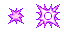
>
> 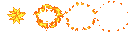

### <https://blackdragon1727.itch.io/fire-pixel-bullet-16x16>

>  [e]
>
>  [e]

## [Cainos](https://cainos.itch.io/pixel-art-platformer-village-props)

LICENSE

    This asset pack can be used in both free and commercial projects. You can modify it to suit your own needs. Credit is not needed but appreciated.  You may not redistribute it or resell it.

> 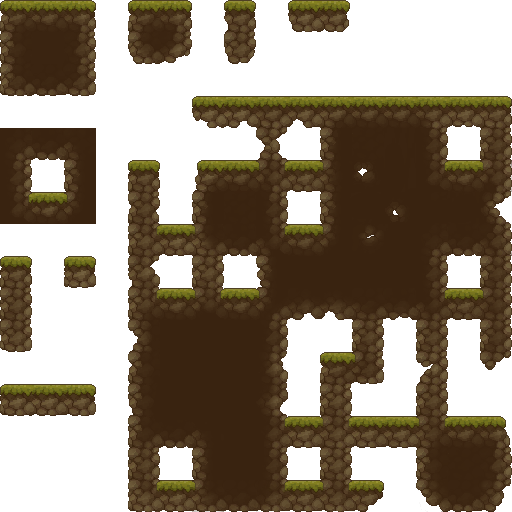

## [Camacebra Games](https://camacebra.itch.io/spider-pixel-art-pack-16x16)

LICENSE

    * License Type: Public license.
    * Creadits are not required but you can follow me on twitter to support me c: 

> 
>
> 

## [GrafxKid](https://grafxkid.itch.io/cave-tileset)

[LICENSE](https://creativecommons.org/publicdomain/zero/1.0/ "CC0 1.0")

> 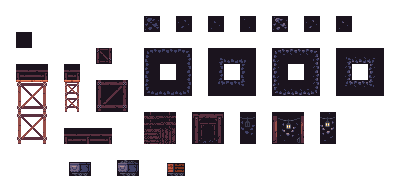

## [Lunarnia](https://lunarnia.itch.io/pixel-purple-gem)

LICENSE

    - Feel free to use this asset for personal and commercial purpose
    - Credit is required
    - You cannot resell/redistribute this asset

> 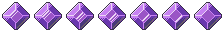

## [NYKNCK](https://nyknck.itch.io/staranimation)

> 

## [Secret Hideout](https://secrethideout.itch.io/team-wars-platformer-battle)

LICENSE

    You can use this asset both personally and commercially. Please help support my artwork by giving credit. This is not mandatory but is very much appreciated.

<!-- > 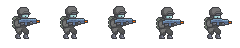
>
> 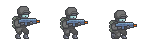
>  -->
>  [e]
>
> 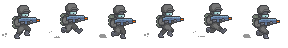
>
> 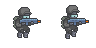
>
> 

<!-- > 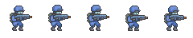
>
> 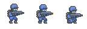
>  -->
>  [e]
>
> 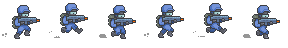
>
> 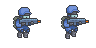
>
> 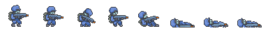

<!-- > 
>
> 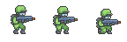
>  -->
> 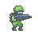 [e]
>
> 
>
> 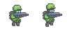
>
> 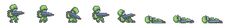

<!-- > 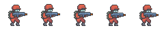
>
> 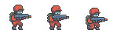
>  -->
> 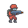 [e]
>
> 
>
> 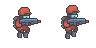
>
> 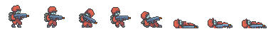

<!-- > 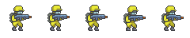
>
> 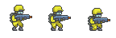
>  -->
> 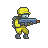 [e]
>
> 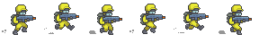
>
> 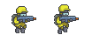
>
> 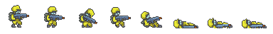

## [TheWiseHedgehog](https://thewisehedgehog.itch.io/thsp)

[LICENSE](https://creativecommons.org/licenses/by/4.0/ "CC BY 4.0")

> 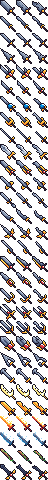

## [TotusLotus](https://totuslotus.itch.io/small-platformer-pack)

LICENSE

    This asset pack can be used in both free and commercial projects. You can modify it to suit your own needs. Credit is not needed.  You may not redistribute it or resell it. If you will use this asset for commercial use please consider donating.

> 
>
> 
>
> 
>
> 

## [Will Tice](https://untiedgames.itch.io/floating-skull-enemy)

[LICENSE](http://untiedgames.com/files/license.txt "Will's Public License")

> 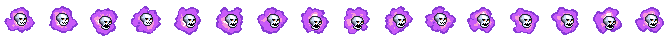 [e]

## [Wishforge](https://wishforge.itch.io/free-platformer-pixel-art-assets)

> 
>
> 

---

[e]: *Sprites within images are cut out or rearranged from the original image.*
