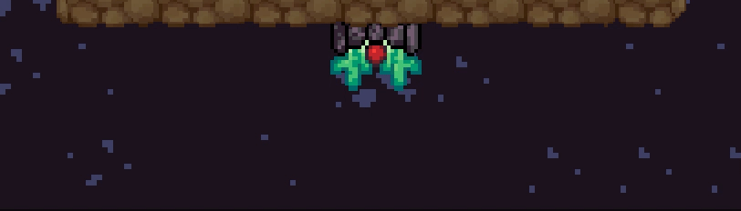
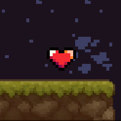

<h1>How to play</h1>

Another Friday afternoon. As your shift comes to an end you ponder on how your demanding job in the mine is a metaphor for the struggles you've had to endure in your early life and how your existence in the mine reflects the ontological statement of God's script as a whole... By the time you're done you realize everyone else has already left and you find yourself at the bottom of a very deep mine, alone in the dark.
As you start making your way up you decide to collect scattered diamonds to flex on your friends once you get out. But to your dismay, the mine is roamed by hordes of creatures. At first sight, they seem harmless - cute slimy creatures in their natural, gloomy habitat. But as you get a better look, you see spikes attached to bodies, concentrated bursts of flammable gasses being ignited and sent recklessly across the mine, creatures created of pure gas and spiders. Yikes.
Not caring about how any of this is physically possible, then again you can just five times your height, you grab your trusty old mining gun and ascend.
Relentless, you make note of these obstacles in your journey to the light and jot down a few notes.

---

**A list of notes:**

- [1 Player](#1-player)
  - [1.1 Movement](#11-movement)
  - [1.2 Health](#12-health)
  - [1.3 Difficulty](#13-difficulty)
  - [1.4 Score](#14-score)
  - [1.5 Shooting](#15-shooting)
- [2 Enemies](#2-enemies)
  - [2.1 Slimes](#21-slimes)
  - [2.2 Wall shooters](#22-wall-shooters)
  - [2.3 Ceiling shooters](#23-ceiling-shooters)
  - [2.4 Gaseous balls](#24-gaseous-balls)
  - [2.5 Spiders](#25-spiders)
- [3 Collectible items](#3-collectible-items)
  - [3.1 Diamonds](#31-diamonds)
  - [3.2 Small hearts](#32-small-hearts)
  - [3.3 Large hearts](#33-large-hearts)
  - [3.4 Large explosive diamonds](#34-large-explosive-diamonds)
  - [3.5 Checkpoints](#35-checkpoints)
- [4 A Dream of Spring](#4-a-dream-of-spring)

---

## 1 Player

First, a journey within. Learn about self-control and how to use your mining gun to obliterate any who dare oppose you.

### 1.1 Movement

The art of moving one's body is a matter of balance. Two keys will help you achieve this balance:
 - The Liberal <kbd>A</kbd> moves your reliable self in the direction often referred to as left
 - The Conservative <kbd>D</kbd> displaces your righteous existence to the right

Another matter of note is gravity, this vicious beast will drag you down into the pits of the mine. One can fight this mighty foe by relying on the power of the Enlightened <kbd>Space</kbd> to yeet oneself toward the stars.

### 1.2 Health

You have limited vitality, displayed as a number of hearts in the top left corner. Upon taking damage, you lose a heart and are invincible for a short duration. When you run out of hearts, you die. Simple stuff.

### 1.3 Difficulty

Right under your health, you can see an array of swords. These represent how buff the enemies are. The more swords, the more care you should take.

Difficulty increases as you progress upward.

### 1.4 Score 

In the bottom left corner, you can see your score. This is the number of diamonds you have collected.

Just for flex...

### 1.5 Shooting

You MKA-POWVII Super Extremely PowerfulTM Mining Gun2 For Excavation of Diamonds&copy;, now repurposed for slime excavation, is your only companion on this journey of self-rediscovery.

The gun automatically targets mice. If you have one at your disposal, you use it for aiming. If you want to take this a step further, you can execute the mythical move known as the Left Click of a Pointing Device to fire your mining gun. Legends say that some are so experienced, that they are able to use this move indefinitely.

---

## 2 Enemies

Fiends that will give their lives to hinder your ascension. Note that they may get *a little* tougher higher up...

### 2.1 Slimes

These creatures have the IQ of rocks, less even. They seem content just roaming from side to side, the rest of the world notwithstanding. Going near them shooting them or even letting them attack you, they never seem to break pace.

They aren't hard to kill, but there is a lot of them. Some you can avoid by going by other platforms and some you can outrun.
Be careful, though, if they hit you, they'll knock you back - if you're near a cliff you can lose a lot of progress.

### 2.2 Wall shooters

Slimes that have grown out their spikes to attach to a wall. They still hurt when touched, but their main pain point is that you shoot balls of fire across the mine.

They are easy to avoid when alone, but take care of stray fireballs in crowded situations.

### 2.3 Ceiling shooters

Some wall shooters seem to have developed brains and realized their methods aren't very effective and started shooting in the direction of their prey instead of the opposite wall. But doing this from walls will lead to limited results and so they have migrated to the underside of platforms.

They will aim in your direction so try not to stand still for too long. They cannot shoot upwards.

### 2.4 Gaseous balls

A high concentration of gasses. Yup. Makes sense. They aren't smart but do hurt. At higher elevations, they seem to be able to light parts of themselves on fire and chuck them at you.

Don't ask why they have a face.

### 2.5 Spiders

Because no one likes spiders and they just have to be here, *sigh*!. They have half a brain and will not waste energy unless you are near them.

They attach to ceilings and if you wall below them they will drop on you. Be careful, they hide in the shadows.

---

## 3 Collectible items

Some of these will help you and others will... also help you, except diamonds, they're just a flex.

### 3.1 Diamonds

Not much special here. It's the ultimate show of your skill, providing you with hoards of material wealth. But that doesn't do you much good here. Maybe once you get to the surface?

They are scattered all over the mine. Upon un-aliving enemies, they will drop.

### 3.2 Small hearts

These are nifty. Sometimes your mining gun can carve out a small piece of your adversary's soul and body for you to consume and replenish your health.

Gas has a higher chance of coalescing into a small heart, for some reason.

### 3.3 Large hearts

Be on the lookout for these. They sometimes appear in the mine. If you see one, definitely collect it, trust me.

It replenishes all of your health and increases your maximum vitality by one.

### 3.4 Large explosive diamonds

Found yourself surrounded by enemies? Do not despair! Unless you can't see one of these around, then despair... But if there is one around, reach it at all cost.

It will *almost* certainly eliminate all enemies in the vicinity and grant you a brief touch of immortality.

### 3.5 Checkpoints

Last but - **definitely** - not least, God was kind enough to give you checkpoints. Once you touch one, and then death touches you, the checkpoint will want to touch you again... yeah.

But to not make things too easy, they are hard to spot. Be on the lookout for sparkling stars.

---

## 4 A Dream of Spring

As you have spent days climbing up, you start to consider the possibility that the mine is somehow endless. And the only comfort you have is no one is stopping you from obtaining material justification for your struggles.

Like oil and water, some things just aren't meant to be...